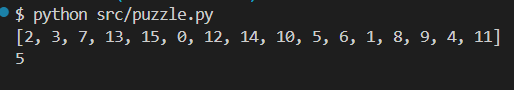

# Juego de puzzles "15-Puzzle"

## Descripción:
Consiste en un juego de rompecabezas deslizante donde el jugador debe ordenar las piezas numeradas en una cuadrícula.

### Características clave:

• Generación de puzzles desordenados.

• Movimiento de piezas con reglas.

• Verificación de solución y conteo de movimientos.

### Características clave:

• Generación aleatoria de puzzles.

• Movimiento de piezas con reglas específicas.

• Verificación de la solución y conteo de movimientos.


## Puzzle.py
### Generar board
Generamos un board, una lista de números del 0 al 15 desordenada, donde 0 representa a la posición vacía

```python
def generate_board_position(self):
    Fboard = [i for i in range(16)]
    board = []
    j = 0
    while Fboard != []:
        i = rd.choice(Fboard)

        if i == 0:
            position = j
        j += 1
    
    return board, position
```

