# Juego de puzzles "15-Puzzle"

# ¿Como correr el juego?

### src/
Carpeta con los archivos del juego

#### main.py
Contiene la visualización del juego con la librería pygame

#### puzzle.py
Contiene la lógica del juego y la opción de jugarlo en consola
Se asegura tambien de que cada tablero sea resoluble, lo que garantiza un fin adecuado
### tests/
Añadiremos los tests durante el desarrollo. Agregamos un archivo en `tests/` por cada funcionalidad a probar

## Descripción:
```bash
git clone https://github.com/siok20/CC3S2-Parcial-15-Puzzle
```

## Correr localmente con pygame
Para correr localmente el programa, después de clonar el repositorio debemos crear un entorno virtual y activarlo.
```
python3 -m venv venv
source venv/bin/activate
```
Luego instalar las dependecias:
```
pip install -r requeriments.txt
```
Ahora sí puedes correr el programa con pygame:
```
python src/main.py
```

Ahora sí puedes correr el programa en consola:
```
python src/puzzle.py
```

Juego contenerizado en Docker

```bash
docker build -t game .
```

```bash
docker run game 
```

### Interpretación:
Manejamos los movimientos `up`, `down`, `left` y `right`.
Consideramos que es la casilla en blanco la que se mueve en cualquiera de esas 4 direcciones.

### Características clave:

• Generación de puzzles desordenados.

• Movimiento de piezas con reglas.

• Verificación de solución y conteo de movimientos.


### Características clave:

• Generación aleatoria de puzzles.

• Movimiento de piezas con reglas específicas.

• Verificación de la solución y conteo de movimientos.


## Implementación de la interfaz gáfica del juego

En esta rama se implemento la visualizacion y generación del tablero para el juego. 
Para implementar la interfaz al juego primero se hizo la salida en consola luego se decidió usar la librería `pygame` con lo cual ya teniamos mayor facilidad para hacer los movimientos con las flechas del teclado.

Primera salida por consola 
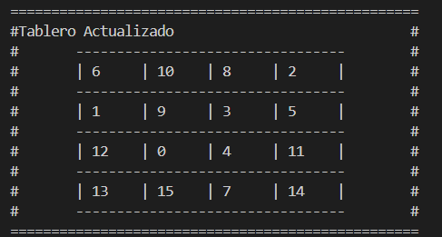

Salida luego de implementarlo con la libreria pygame
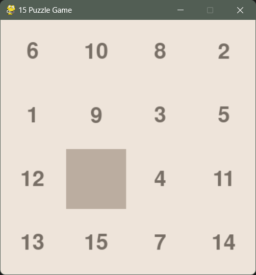

Tammbién se implemento los eventos para los movimeintos de las flechas en el teclado.

```python
for event in pygame.event.get():
            if event.type == pygame.QUIT:
                running = False
            elif event.type == pygame.KEYDOWN:
                if event.key == pygame.K_UP:
                    puzzle.game.move("up")
                if event.key == pygame.K_DOWN:
                    puzzle.game.move("down")
                if event.key == pygame.K_RIGHT:
                    puzzle.game.move("right")
                if event.key == pygame.K_LEFT:
                    puzzle.game.move("left")
```

Luego se decidio implementar la actualización de los movimientos en la consola usando la función display, esos cambios se realizaron en la rama `feature/eladio` ya que contenía la lógica de los movimientos con lo cual ya se podía tener el estado del tablero por cada movimiento.

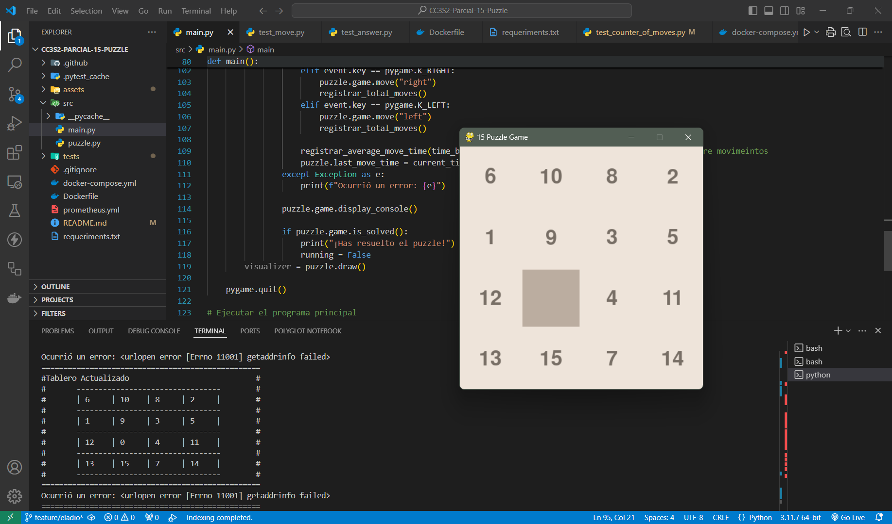


## Puzzle.py
### Generar board
Generamos un board, una lista de números del 0 al 15 desordenada, donde 0 representa a la posición vacía

```python
def generate_board_position(self):
    Fboard = [i for i in range(16)]
    board = []
    j = 0
    while Fboard != []:
        i = rd.choice(Fboard)

        if i == 0:
            position = j
        j += 1
    
    return board, position
```

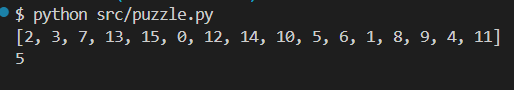

### Movimiento 
Se define un movimiento y el juego evalúa si es válido 
De serlo se procede a modificar el board

```python
def move(self, direction):
    '''
    Logica de movimiento
    obtiene una direccion y el juego cambia las posiciones
    del elemento vacio y hacia donde se dirige

    En caso de movimiento valido
    '''
    row = self.position // 4
    col = self.position % 4

    if direction == 'up':
        if row == 0: 
            print("Movimiento invalido")
            return

        self.board[self.position],self.board[self.position-4] = self.board[self.position-4],self.board[self.position] 
        self.position -=4

    elif direction == 'down':
        if row == 3: 
            print("Movimiento invalido")
            return
        
        self.board[self.position],self.board[self.position+4] = self.board[self.position+4],self.board[self.position] 
        self.position +=4

    elif direction =='left':
        if col == 0:
            print("Movimiento invalido")
            return
        
        self.board[self.position],self.board[self.position-1] = self.board[self.position-1],self.board[self.position] 
        self.position -= 1
    elif direction == 'right':
        if col == 3:
            print("Movimiento invalido")
            return
        
        self.board[self.position],self.board[self.position+1] = self.board[self.position+1],self.board[self.position] 
        self.position += 1

```

Ejemplo aplicando el movimiento `'up'`

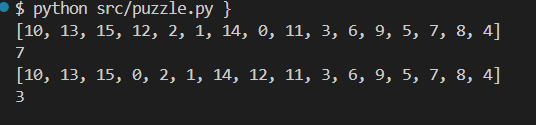

## Prometheus y Grafana
Primero añadimos en requirements.txt el prometheus_client para que al construir y alzar el docker-compose se instale y podamos definir los contadores.

## Pruebas de comportamiento

Para las pruebas de comportamiento utilizamos Gherkin con Behave, definimos los escenarios y luego traducimos los pasaos a lenguaje python.

Po ejemplo definimos el escenario donde un movimiento es invalido de la siguiente forma:

```gherkin
  Scenario: Movimiento inválido hacia abajo
    Given el juego tiene una casilla vacía en la posición 13
    When presiono la tecla de flecha abajo
    Then el movimiento debería ser inválido
    And la casilla vacía debería permanecer en la posición 13
```

Esto se traduce con behave como:

```python
@given('el juego tiene una casilla vacía en la posición {position}')
def step_given_juego_con_casilla_vacia(context, position):
    context.game = puzzle()
    position = int(position)
    
    tablero = [i for i in range(1, 16)] #crea una lista de numeros del 1 al 15
    tablero.insert(position, 0) #inserta el 0 en la posicion que se especifica

    context.game.set_board(tablero) #se asigna el tablero generado al juegp
    context.game.position = position  #se establece la posición de la casilla vacía

@when('presiono la tecla de flecha abajo')
def step_when_mover_abajo(context):
    context.result = context.game.move("down")

@then('el movimiento debería ser inválido')
def step_then_movimiento_invalido(context):
    assert context.result == False, "El movimiento debería ser inválido"

@then('la casilla vacía debería permanecer en la posición {position}')
def step_then_casilla_vacia_posicion(context, position):
    position = int(position)
    assert context.game.position == position, f"La posición esperada era {position} pero resultó {context.game.position}"

```

De esa misma forma definimos 3 escenarios más. Luego para correr las pruebas debemos ejecutar el comando:

```bash
behave tests/features/
```

Debería obtener un resultado como este:

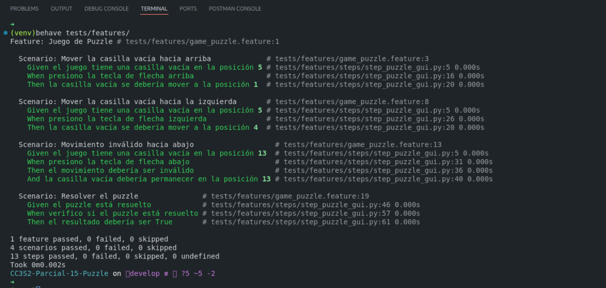


### Configuración del pipeline

En el directorio `.github/workflows` se creo el archivo `ci.yml` que configura un pipeline de integración continua (CI) utilizando GitHub Actions. Este pipeline está diseñado para automatizar el proceso de pruebas.

```yaml
name: CI - Pipeline

on:
  push:
    branches:
      - develop
      - feature/daniela
  pull_request:
    branches:
      - develop
      - feature/daniela

jobs:
  test:
    runs-on: ubuntu-latest

    steps:
    - name: Checkout code
      uses: actions/checkout@v2

    - name: Set up Python
      uses: actions/setup-python@v2
      with:
        python-version: '3.9'  

    - name: Install dependencies
      run: |
        python -m pip install --upgrade pip
        pip install -r requeriments.txt
        pip install behave pytest 

    - name: Run Unit Tests  
      run: pytest tests/  
      

    - name: Run Behave Tests  
      run: behave tests/features/ 
```
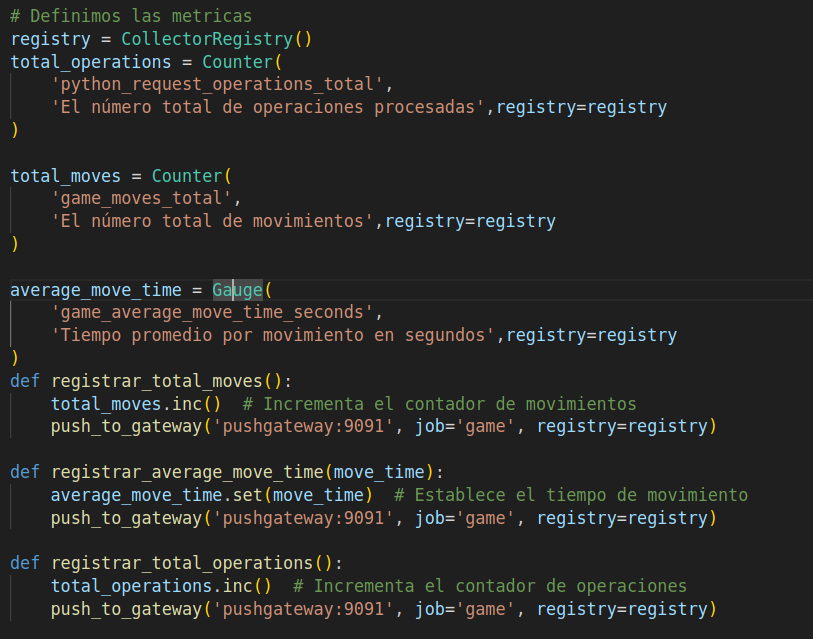  

En el archivo prometheus.yml dentro de scrape_configs configuramos un job, el cual sera pushgateway ya que luego apuntará al pushgateway de docker-compose

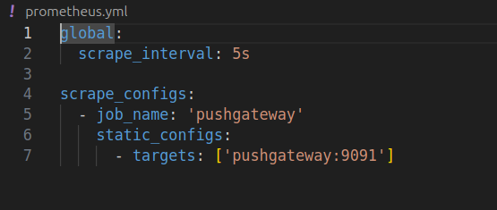  

Le decimos al docker-compose.yml que prometheus correrá en el puerto 9090 mientras que grafana en el 3000, y el pushgateway en el 9091, ahí último veremos cómo se recogen las métricas.

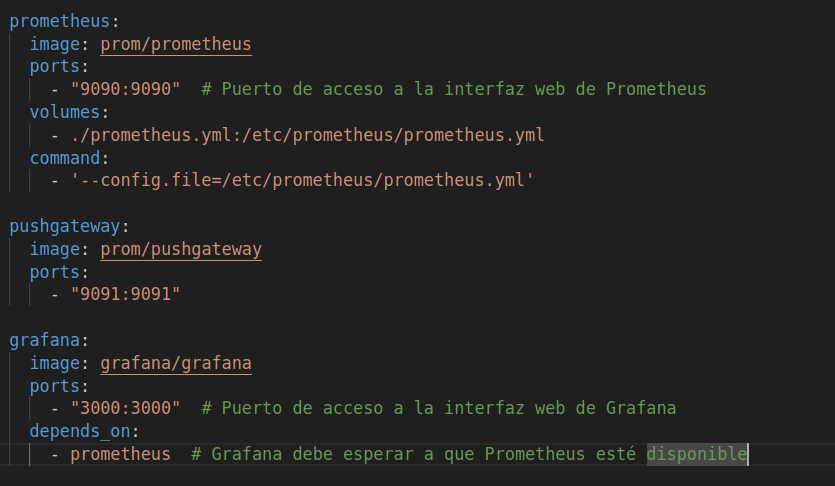 

Nos vamos al puerto 9090 y veriicamos que el endpoint `pushgateway:9091` esté alzado.
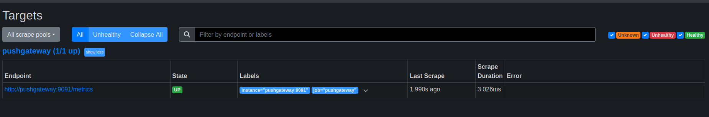 

También verificamos que las métricas generales estén en 9091/metrics y que cambien de acuerdo a los movimientos del juego.
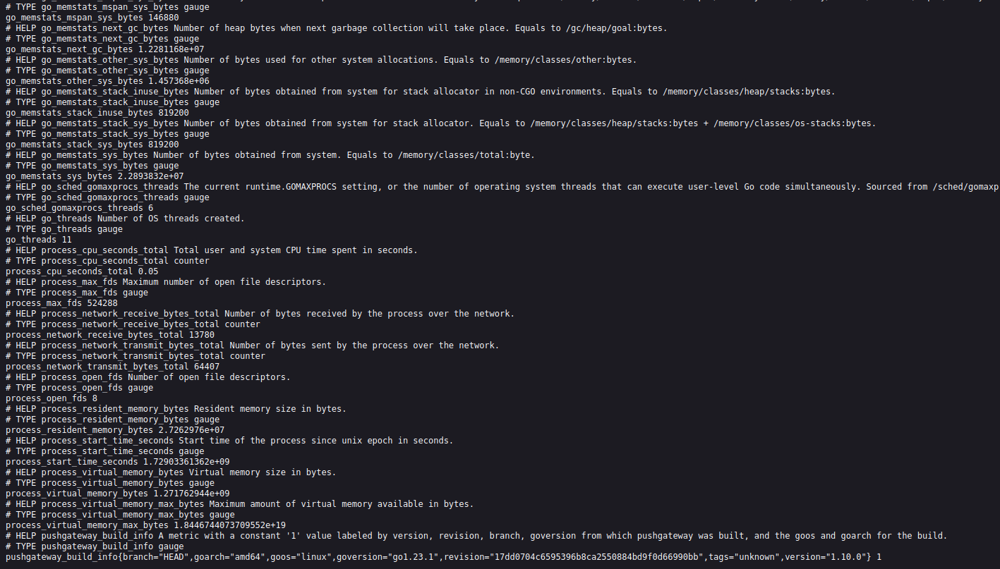 

Nos dirigimos a localhost:3000 para entrar a la interfaz de Grafana, lo conectamos con Prometheus pasándole el url correspondiente.
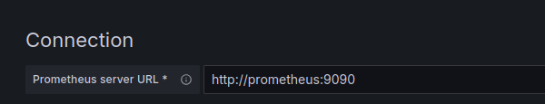 
Verificamos si se ha podido conectar:
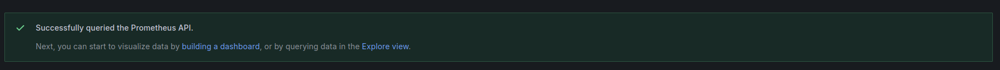
Luego realizamos movimientos en el puzzle y seleccionamos algunas métricas para monitorear la aplicación.
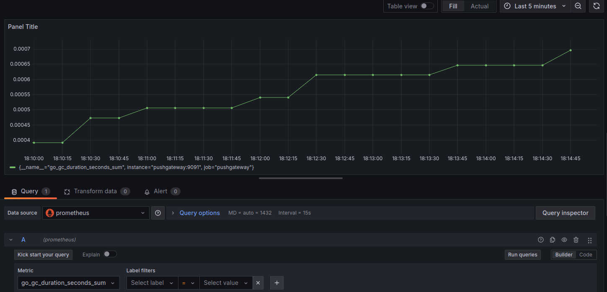
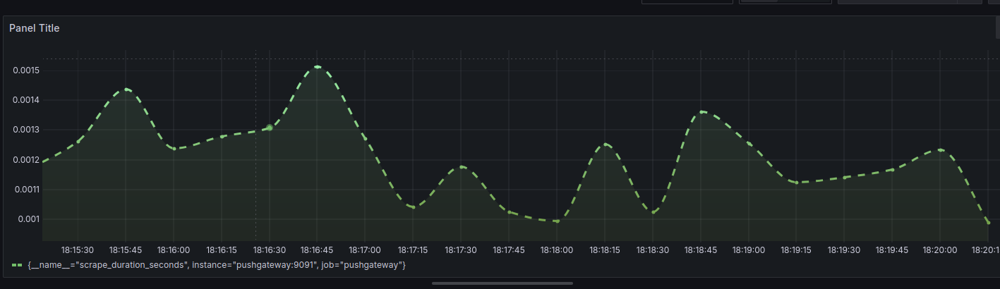

## Dockerfile
```
FROM python:3.9-slim

# Establece el directorio de trabajo
WORKDIR /app

# Copia el archivo de requisitos y instala las dependencias de Python
COPY requeriments.txt .
RUN pip install --no-cache-dir -r requeriments.txt

# Copia el resto del código fuente
COPY . ./

# Comando por defecto para ejecutar el juego
CMD ["python", "src/puzzle.py"]

```


### Usar pygame con Dockerfile
Fue necesario cambiar el Dockerfile de acuerdo a las necesidades de nuestro proyecto.
Y lo que nosotros necesitábamos era correr el programa con pygame dentro del contenedor, para ello se necesitaba instalar algunas librerías relacionadas con el sistema X11 de Linux.
Luego de estos cambios se puede correr docker junto al juego con interfaz gráfica y ya no solo localmente con `python3 src/main.py`.
```
FROM python:3.9-slim

# Establece el directorio de trabajo
WORKDIR /app

# Copia el archivo de requisitos y instala las dependencias de Python
COPY requeriments.txt .
RUN pip install --no-cache-dir -r requeriments.txt

# Copia el resto del código fuente
COPY . ./

# Instala las dependencias del sistema necesarias para Pygame
RUN apt-get update && \
    apt-get install -y --no-install-recommends \
    libx11-6 \
    libxext6 \
    libxrender1 \
    libxinerama1 \
    libxi6 \
    libxcursor1 \
    libxtst6 \
    tk-dev \
    x11-apps\
    && rm -rf /var/lib/apt/lists/*

# Comando por defecto para ejecutar el juego
CMD ["python", "src/main.py"]

```
## Historias de usuario hechas


Dentro del board para el primer sprint tuvimos algunos issues el cual se completaron.
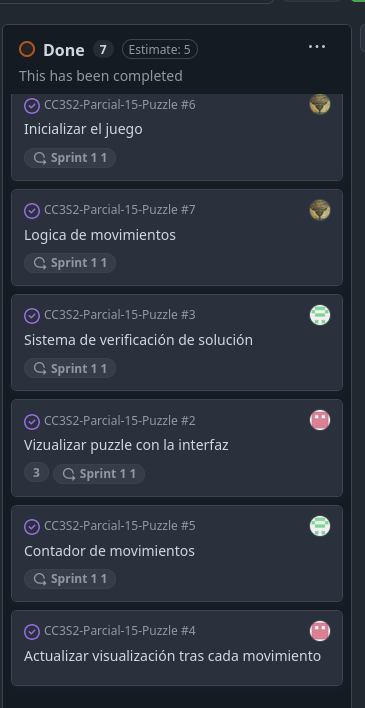 

- Uno de ellos era el sistema de verificación de soluciones, esta función ubicada en puzzle.py, lo que hace es comparar cada valor del board con los números desde el 1 hasta el 15, y por último verifica si la última posición, o sea, la 16 es 0, ya que ahí debe quedar el espacio que representa al vacío, si se cumple todo esto retornará True y se tomará como resuelto.


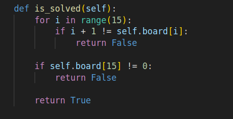  

- Dentro de la clase Puzzle, ponemos un contador que se inicializa en 0 y se incrementará cuando hayan movimientos válidos los cuáles se filtrarán en la función move().

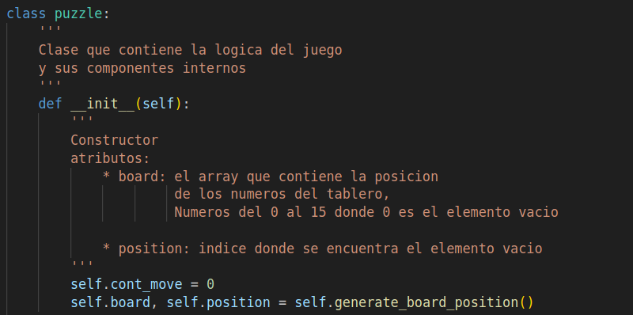

- Para esta implementación se creó un test para verificar que funcione correctamente:

En este test creamos un board con un estado específico para atender a casos donde un movimiento sea inválido y otros válidos, por ejemplo si notamos el espacio vacío corresponde a la primera casilla, y el `game.cont_move=0` al hacer un movimiento hacia arriba debería seguir en 0 ya que no es movimiento válido, para el movimiento hacia abajo sí es válido así que se espera que el contador de movimiento de 1, luego para un movimiento a la izquierda el contador debería seguir dando uno porque no es válido, y por último para la derecha sí sería válido por eso se espera que sea 2.

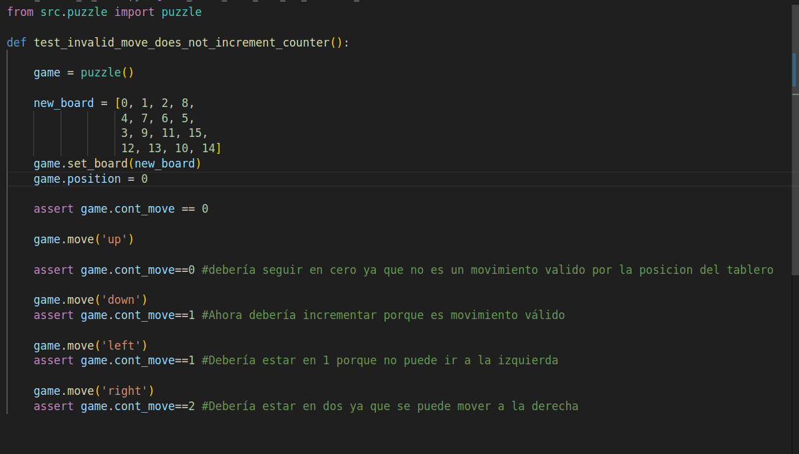